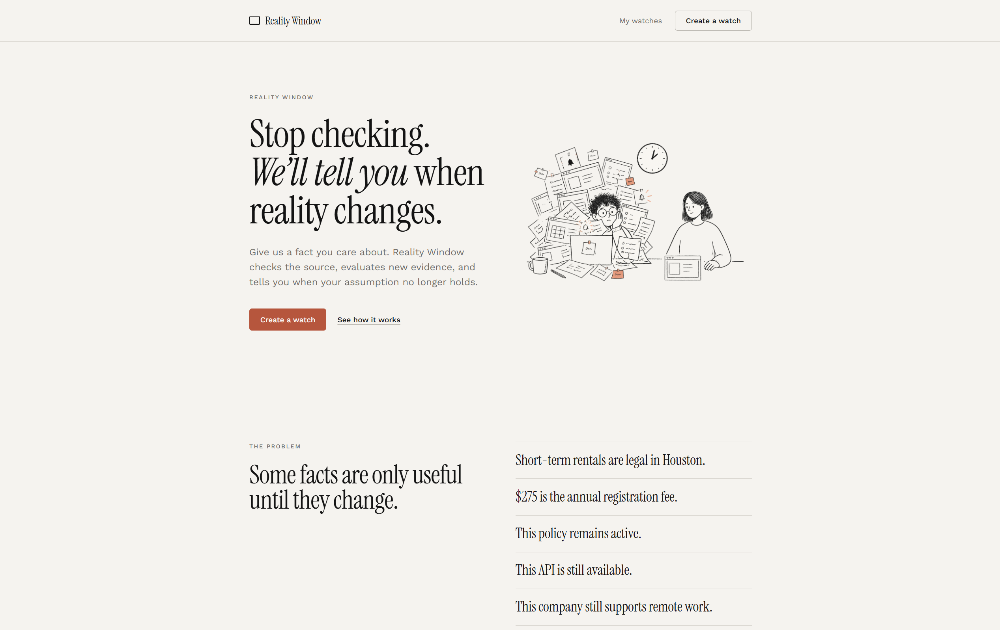
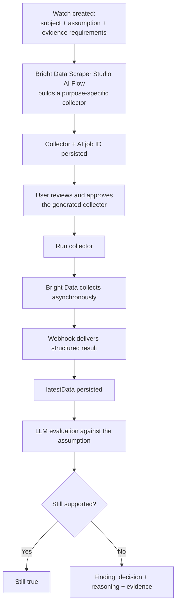

# Reality Window

You state something you believe. We watch whether it's still true.

Built for **Into the Scrape-Verse** — WeMakeDevs × Bright Data.

   

---

## Preview



<!-- | Watch creation | Evaluation result |
|---|---|
|  |  |\\ -->

---

## What it does

Most monitoring tools track a URL and tell you when it changed. That's not usually what you actually want to know. A page can change and nothing you care about is different. A single sentence can change and everything is different.

Reality Window tracks a belief instead of a URL. You give it a subject, an assumption, and the kind of evidence that would prove the assumption wrong. Bright Data Scraper Studio's AI Flow builds a collector for that source — we don't hand-write selectors per site — runs it, and an LLM checks the fresh evidence against what you said you believed. If it still holds, nothing happens. If it doesn't, you get a structured reason why, not a diff you have to interpret yourself.

|                                                | Page-change monitors | Asking ChatGPT/Gemini once             | Reality Window                                                        |
| ---------------------------------------------- | -------------------- | -------------------------------------- | --------------------------------------------------------------------- |
| What's tracked                                 | A URL                | A question                             | An assumption + the evidence that would break it                      |
| Changed-but-irrelevant vs. actually-broke      | No distinction       | No persistent state to compare against | LLM evaluates against the stated assumption                           |
| Persistent state across runs                   | Limited              | No                                     | Yes — watch, scraper, observations, and evaluations are all persisted |
| Collector built without hand-written selectors | Usually no           | N/A                                    | Yes, via AI Flow                                                      |
| Output format                                  | Alert/diff           | Prose                                  | Typed: decision, reasoning, evidence, changed fields                  |

---

## How it works



Bright Data isn't sitting off to the side producing a feed nobody reads. Its structured collection becomes the evidence the evaluation layer reasons over — take it out and there's nothing to reason about.

---

## Worked example

**Question:** Are Houston's short-term rental requirements still the same?

**Watch**

- Subject: Houston short-term rental regulations
- Assumption: short-term rentals remain legal for registered hosts in Houston
- Evidence requirements: legality/registration changes, the $275 annual fee, the January 1 2027 platform-compliance deadline, court rulings or legislative changes affecting enforcement

Reality Window builds the collector, waits for the user to approve it, runs it, gets the webhook back, persists the observation, and evaluates it against the assumption above. The result is typed — decision, reasoning, evidence, what changed — not a paragraph you have to parse yourself.

A step-by-step presenter walkthrough of this exact run lives in [`docs/demo-script.md`](docs/demo-script.md) rather than here — this README explains what the product is; that file is for whoever's driving the live demo.

---

## Design decisions that mattered

**Collector lifecycle is persisted state, not a single API call.** Collector ID, AI job ID, collection ID, scraper status, latest data, evaluation state all live in the database. The app can recover a scraper's status independent of any one request.

**Collection is webhook-driven.** The run endpoint returns a collection ID and moves the scraper into a running state; it doesn't hold the connection open waiting for Bright Data to finish. Blocking on an async collection would've been the easier thing to fake for a demo — we didn't.

**State transitions are guarded.** A completed scraper can't be re-triggered outside its lifecycle by accident.

**Webhook delivery is treated as repeatable, not exactly-once.** Async delivery isn't guaranteed exactly-once anywhere in practice, so collection identity and persisted state are designed to be durable rather than assuming every webhook fires exactly once.

**LLM output is typed.** Decision, reasoning, evidence, and changed fields are separate fields, not one block of model text the UI dumps onto the screen.

---

## API surface

| Method | Endpoint                                              | Purpose                                                    |
| ------ | ----------------------------------------------------- | ---------------------------------------------------------- |
| `POST` | `/api/watches`                                        | Create a watch                                             |
| `GET`  | `/api/watches`                                        | List watches                                               |
| `GET`  | `/api/watches/:watchId`                               | Retrieve a watch                                           |
| `POST` | `/api/watches/:watchId/evaluate`                      | Evaluate the latest observation                            |
| `GET`  | `/api/watches/:watchId/evaluations`                   | Retrieve evaluation history                                |
| `POST` | `/api/watches/:watchId/scraper`                       | Create the collector via Bright Data AI Flow               |
| `GET`  | `/api/watches/:watchId/scraper`                       | Retrieve scraper state                                     |
| `GET`  | `/api/watches/:watchId/scraper/progress`              | Retrieve AI Flow build progress                            |
| `POST` | `/api/watches/:watchId/scraper/approve`               | Approve the generated collector before it's allowed to run |
| `POST` | `/api/watches/:watchId/scraper/run`                   | Trigger the approved collector                             |
| `GET`  | `/api/watches/:watchId/scraper/dataset/:collectionId` | Retrieve a completed dataset by collection ID              |

A separate `/api/scraper` router and the Bright Data webhook route also exist; not detailed here.

---

## Stack

| Layer           | Technology                           |
| --------------- | ------------------------------------ |
| Frontend        | React / TypeScript                   |
| Backend         | Node.js / TypeScript / Express       |
| Database        | PostgreSQL via Prisma                |
| Web extraction  | Bright Data Scraper Studio (AI Flow) |
| Async ingestion | Bright Data Webhooks                 |
| Reasoning       | LLM, structured output               |

---

## Repository structure

```
reality-window/
├── backend/
│   └── src/
│       ├── watches/        Watch lifecycle and planning
│       ├── scraper/        Bright Data integration + scraper lifecycle
│       ├── evaluation/     Evidence evaluation
│       ├── llm/            Providers, prompts, reasoning
│       ├── controllers/    HTTP controllers
│       └── routes/         Express routers (watches, scraper)
├── frontend/                Product UI
├── docs/
│   ├── screenshots/
│   └── demo-script.md
└── README.md
```

---

## Running it locally

```bash
# backend
cd backend
npm install
npx prisma generate
npx prisma migrate dev
npx tsc --noEmit
npm run dev

# frontend
cd frontend
npm install
npm run dev
```

Needs a Bright Data account/API key and LLM provider credentials. Don't commit them.

Verifying the Bright Data flow end to end:

```
1. Create a watch
2. Create its AI Flow scraper
3. Poll scraper progress
4. Confirm collector is ready
5. Run the collector, capture collectionId
6. Wait for the Bright Data webhook
7. Confirm latestData is persisted
8. Run evaluation
9. Confirm evaluation is persisted
```

---

## What's built and what isn't

The core loop is real and runs end to end: **assumption → acquisition → observation → evaluation.** It's not, right now, a generic monitoring platform, and we're not writing this section to obscure that.

Not in this build yet:

- Scheduled re-evaluation — evaluation is triggered, not cron-driven
- Distinguishing "baseline established" from "drift" on the first run
- Comparison against prior evaluations / explicit `Finding` objects
- Change-detection diffing on top of raw evaluation
- Notifications when an assumption becomes unsupported
- Historical watch timeline, richer evidence views

Cut on purpose so what's shipped stays something we can fully explain, not a diagram with three working corners and four aspirational ones.

---

## Hackathon

**Challenge:** Into the Scrape-Verse
**Organized by:** WeMakeDevs × Bright Data
**Theme:** Self-healing web scrapers
